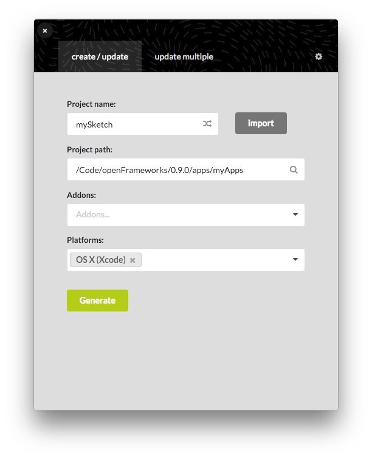

# openFrameworks projectGenerator Frontend

This project is a frontend for creating and updating openFrameworks projects. It provides an easy-to-use interface for the command line-based utility which does the actual work of generating project files for a variety of platforms.

While the command line utility provides a number of advanced features such as using local addons specific to a project or project templates for using a specific OpenGL version, this frontend aims to expose the most frequently used features used by a majority of users. Over time it will grow to add more of these advanced features. For more info on these features, see the `commandLine` folder.

This project is built with [Electron](http://electron.atom.io), which provides a [node.js](https://nodejs.org/en/) backend and windowed [Chromium](http://www.chromium.org/Home) context for building cross platform apps with HTML, CSS, and JavaScript.




## Setup

While you do not need the openFrameworks project cloned from GitHub in order to work on the electron app itself, it is probably helpful. You will need it in order to build the command line utility. Otherwise, you can copy an existing `projectGenerator` binary into this project folder.

### Clone the projectGenerator repository

If you are working with openFrameworks from GitHub, you probably already have this repo cloned as a submodule. If not, or if you're unsure, run:

```
cd path/to/openFrameworks
git submodule update --init
```

This will produce no output if the repo is already set up as a submodule, or clone it otherwise.


### Build the commandLine project

Build an updated `projectGenerator` binary from the project in `openFrameworks/apps/projectGenerator/commandLine`. After this, you should have a `projectGenerator` binary inside the `commandLine/bin/` folder

### Copy command line utility binary to frontend

```
cd openFrameworks/apps/projectGenerator
cp commandLine/bin/projectGenerator frontend/app
```

### Install node.js

If you don't already have it, you can install node via a number of means:

- Directly from the [node.js website](https://nodejs.org/en/download/)
- Using a [package manager for your platform](https://nodejs.org/en/download/package-manager/)
  - `brew install node`
  - `apt-get install nodejs`
  - etc.
- Using a node version manager like [nvm](https://github.com/creationix/nvm)
  - Install nvm for your platform, then:
  - `nvm install latest`

### Install frontend dependencies

Install the depencies for the electron app:

```
cd openFrameworks/apps/projectGenerator/frontend
npm install
```

### Updating
It's always good to update npm before generating the PG.  
```
npm update
```

### Debugging
You can open `settings.json` to enable some hidden settings, useful for debugging.  
Moreover, Electron uses Webkit so all the Webkit developper tools are available to you. ( `Cmd/Ctrl` + `Shift` + `i` from the Electron window.)  

 - Console messages from `index.js` show up in the terminal (where you did `npm start`).  
 - Console messages from `app.js` show up in the Webkit console.

## Run

### Development

Run a development build with:

```
npm start
```

### Release

To build & package the app for OS X, Linux, and Windows, using [electron-packager](https://github.com/maxogden/electron-packager):

```
npm run build
```

To build a platform-specific package:

```
npm run build:macos
npm run build:linux32
npm run build:linux64
npm run build:vs
```

This will created a packaged app for that platform(s) specified inside the `dist` folder.


## License

MIT (http://openframeworks.cc)
